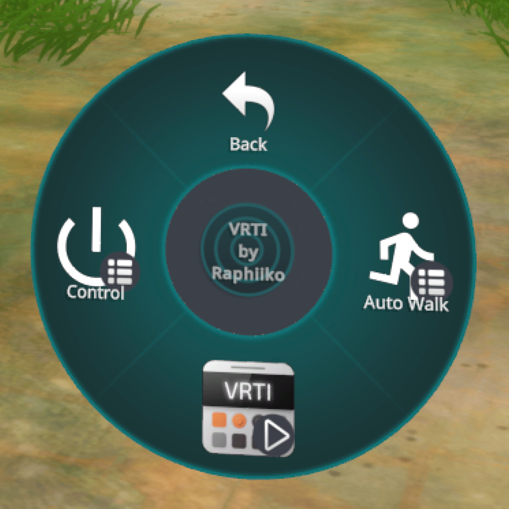
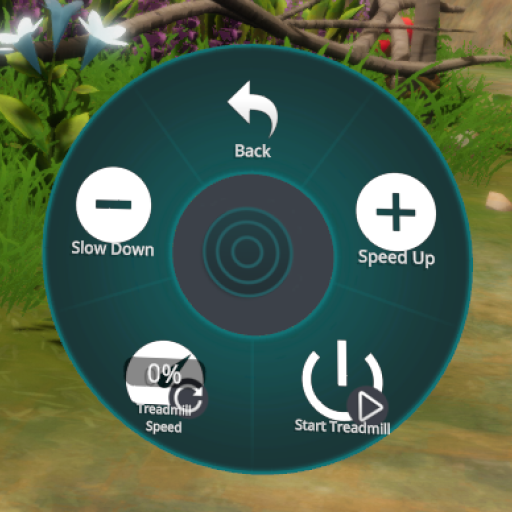
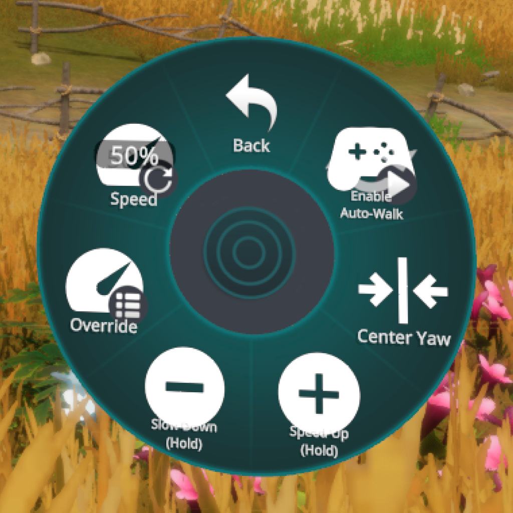
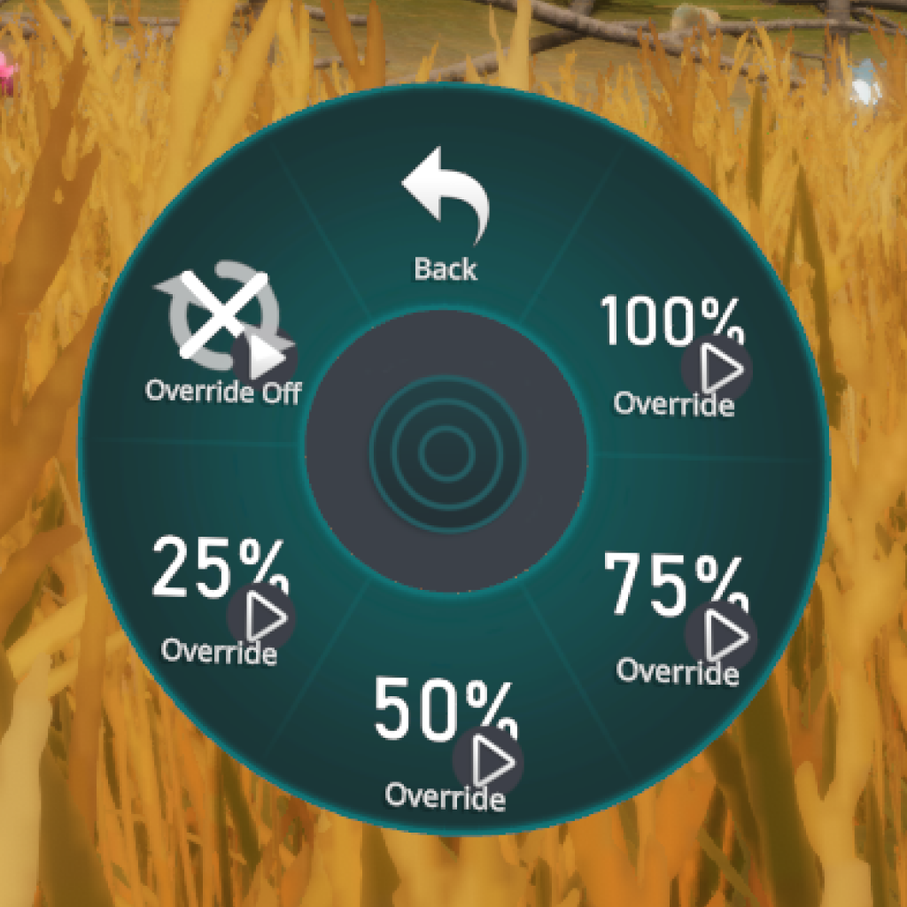

import { Badge, LinkButton } from "@astrojs/starlight/components";
import maLogoImage from "../../../../assets/ma_logo.png";
import AutoWalkOffsetDemo from "../../../../assets/vrti/autowalk_offset_demo.webm";
import "VRChat & OSC Control.scss";

VRTI itself can be controlled over OSC, allowing you to control your treadmill from external applications, like VRChat!
Below you will find several methods to control VRTI over OSC.

## VRChat

### VRTI Menu Avatar Prefab

The easiest way you can control VRTI from within VRChat, is by using VRTI's Menu Avatar Prefab.
You simply install it on your avatar using [Modular Avatar](https://modular-avatar.nadena.dev/docs/intro): Just drag it onto your avatar, upload, and you're good to go!
This requires you to have Modular Avatar installed in your Unity project.

|                                                                    |                                                                            |
| :----------------------------------------------------------------- | :------------------------------------------------------------------------- |
| **Menu**                                                           | **Treadmill Control**                                                      |
|              |          |
| **Autowalk Control**                                               | **Autowalk Speed Overrides**                                               |
|  |  |

<LinkButton
  href="vcc://vpm/addRepo?url=https%3A%2F%2Fvcc.raphii.co%2Findex.json"
  icon="right-arrow"
  variant="primary"
>
  Add to ALCOM or VCC
</LinkButton>
<LinkButton
  href="https://modular-avatar.nadena.dev/docs/intro"
  icon="external"
  variant="secondary"
>
  Get Modular Avatar
</LinkButton>

#### Installation Guide

1. Install [Modular Avatar](https://modular-avatar.nadena.dev/docs/intro) into your Unity project.
2. Add my [package listing](https://vcc.raphii.co/) to either:
   - [ALCOM](https://vrc-get.anatawa12.com/en/alcom/) (Recommended)
   - [VRChat Creator Companion (VCC)](https://vcc.docs.vrchat.com/)
3. Go to your project in ALCOM or VCC, and install the latest "VRTI Avatar Menu" package.
4. In the Project pane in Unity, find the `VRTI Menu` prefab under `Packages` > `VRTI Avatar Menu` > `Runtime`.
5. Drag the `VRTI Menu` prefab onto your avatar in the Hierarchy pane.
6. Upload your avatar to VRChat as usual.

:::tip
Alternatively, VRTI also works with [FitOSC's avatar menu](https://duinrahaic.booth.pm/items/6189333)!
Do note fewer features are supported.
:::

#### Auto Walk: Speed Up & Slow Down

In your Auto Walk menu, you'll find two buttons not found in VRTI's own interface: "Speed Up" and "Slow Down".

You can hold these buttons down to temporarily increase or decrease your auto walk speed.
Perfect to quickly catch up with friends!
This just affects your auto walk speed (the speed at which you move in-game), not your treadmill speed.

<video
  src={AutoWalkOffsetDemo}
  autoplay
  loop
  muted
  class="autowalk-video"
></video>

You can configure how much these buttons affect your speed in VRTI's settings.

Note that you can also control these actions directly using your controller buttons:
By default, pressing down your left stick slows you down, and pressing down your right stick speeds you up!
These bindings can be changed in [SteamVR's controller bindings](/vrti/getting-started/steamvr-controller-bindings) for VRTI.

### Avatar Parameters

In case you'd like to build your own controls, here's a list of the avatar parameters that VRTI will read and write to:

| Avatar Parameter Name                                          | Value Type | Intended VRChat Menu Item |
| :------------------------------------------------------------- | :--------- | :------------------------ |
| [`VRTI/Treadmill/Enable`](#vrtitreadmillenable)                | Boolean    | Toggle                    |
| [`VRTI/Treadmill/Speed`](#vrtitreadmillspeed)                  | Float      | Radial Puppet             |
| [`VRTI/Treadmill/SpeedUp`](#vrtitreadmillspeedup)              | Boolean    | Button                    |
| [`VRTI/Treadmill/SlowDown`](#vrtitreadmillslowdown)            | Boolean    | Button                    |
| [`VRTI/Walking/Enable`](#vrtiwalkingenable)                    | Boolean    | Toggle                    |
| [`VRTI/Walking/Speed`](#vrtiwalkingspeed)                      | Float      | Radial Puppet             |
| [`VRTI/Walking/YawReset`](#vrtiwalkingyawreset)                | Boolean    | Button                    |
| [`VRTI/Walking/OffsetUp`](#vrtiwalkingoffsetup)                | Boolean    | Button                    |
| [`VRTI/Walking/OffsetDown`](#vrtiwalkingoffsetdown)            | Boolean    | Button                    |
| [`VRTI/Walking/Override`](#vrtiwalkingoverride)                | Float      | -                         |
| [`VRTI/Walking/Override/None`](#vrtiwalkingoverridenone)       | Boolean    | Toggle                    |
| [`VRTI/Walking/Override/Preset1`](#vrtiwalkingoverridepreset1) | Boolean    | Toggle                    |
| [`VRTI/Walking/Override/Preset2`](#vrtiwalkingoverridepreset2) | Boolean    | Toggle                    |
| [`VRTI/Walking/Override/Preset3`](#vrtiwalkingoverridepreset3) | Boolean    | Toggle                    |
| [`VRTI/Walking/Override/Preset4`](#vrtiwalkingoverridepreset4) | Boolean    | Toggle                    |

## OSC Reference

When VRTI launches, it binds a random available UDP port to listen for incoming OSC messages.
As part of [OSCQuery](https://github.com/Vidvox/OSCQueryProposal), it advertises its OSC server over Zeroconf/MDNS with service name `_osc._udp.local`.
You will need to discover it to get the port number to send your OSC messages.

### OSCQuery

VRTI's [OSCQuery](https://github.com/Vidvox/OSCQueryProposal) server also binds to a random available TCP port.
It is advertised over Zeroconf/MDNS with service name `_oscjson._tcp.local`.

### OSC Addresses

Below you will find a list of all addresses you can write to.

:::note
All addresses have an additional alias prefixed with `/avatar/parameters`, to support being controlled from VRChat avatar parameters.

Example: `/avatar/parameters/VRTI/Treadmill/Enable` is an alias for `/VRTI/Treadmill/Enable`.
:::

#### /VRTI/Treadmill/Enable

**Value Type:** Boolean 
**Intended VRChat Menu Item:** Toggle

Starts your treadmill when set to `true`, and stops it when set to `false`.

#### /VRTI/Treadmill/Speed

**Type:** Float 
**Intended VRChat Menu Item:** Radial Puppet

Sets the target speed of your treadmill:

- A value of `1.0`, or 100% in VRChat's menu, corresponds to the maximum speed set in VRTI.
- A value of `0.0`, or 0% in VRChat's menu, corresponds to 0.5 km/h or 0.3 m/h.

#### /VRTI/Treadmill/SpeedUp

**Type:** Boolean 
**Intended VRChat Menu Item:** Button

When set to `1`, VRTI will increase the target speed of your treadmill by 0.5 km/h or m/h.

#### /VRTI/Treadmill/SlowDown

**Type:** Boolean 
**Intended VRChat Menu Item:** Button

When set to `1`, VRTI will decrease the target speed of your treadmill by 0.5 km/h or m/h.

#### /VRTI/Walking/Enable

**Type:** Boolean 
**Intended VRChat Menu Item:** Toggle

Enables auto-walk when set to `true`, and disables it when set to `false`.

#### /VRTI/Walking/Speed

**Type:** Float 
**Intended VRChat Menu Item:** Radial Puppet

Sets the auto-walk speed adjustment, allowing you to walk faster or slower in-game without changing your treadmill's speed.

- A value of `0`, or 0% in VRChat's menu, results in a **0x** multiplier.
- A value of `0.5`, or 50% in VRChat's menu, is the neutral position: **1.0x**.
- A value of `1.0`, or 100% in VRChat's menu, results in a **2.0x** multiplier.

#### /VRTI/Walking/YawReset <Badge size="large" variant="tip" text="VR Only" />

**Type:** Boolean 
**Intended VRChat Menu Item:** Button

Resets your walking direction to the direction you are currently are facing.

**Note:** This only has an effect while the yaw lock is enabled.

#### /VRTI/Walking/OffsetUp

**Type:** Boolean 
**Intended VRChat Menu Item:** Button

Temporarily increases your walking speed by 0.25x while the button is held.

When set to `1` (button pressed), adds a +0.25x speed adjustment to your current walking speed.
When set to `0` (button released), removes the adjustment.

#### /VRTI/Walking/OffsetDown

**Type:** Boolean 
**Intended VRChat Menu Item:** Button

Temporarily decreases your walking speed by 0.25x while the button is held.

When set to `1` (button pressed), adds a -0.25x speed adjustment to your current walking speed.
When set to `0` (button released), removes the adjustment.

#### /VRTI/Walking/Override

**Type:** Float 
**Intended VRChat Menu Item:** -

Sets a speed override on the auto walk that replaces the normal speed calculation based on the treadmill speed and multiplier.

- A value between `0.0` and `1.0` sets a fixed walking speed, where `1.0` is maximum walking speed.
- A value of `-1` disables the speed override.

When enabled, this overrides the normal auto walk speed calculation based on the your treadmill speed.

#### /VRTI/Walking/Override/None

**Type:** Boolean 
**Intended VRChat Menu Item:** Toggle

Removes any override on the auto walk speed when set to `1`. The auto walk speed will return to normal speed calculation based on the treadmill speed and multiplier.

#### /VRTI/Walking/Override/Preset1

**Type:** Boolean 
**Intended VRChat Menu Item:** Toggle

Sets a `25%` speed override on the auto walk speed when set to `1`.

#### /VRTI/Walking/Override/Preset2

**Type:** Boolean 
**Intended VRChat Menu Item:** Toggle

Sets a `50%` speed override on the auto walk speed when set to `1`.

#### /VRTI/Walking/Override/Preset3

**Type:** Boolean 
**Intended VRChat Menu Item:** Toggle

Sets a `75%` speed override on the auto walk speed when set to `1`.

#### /VRTI/Walking/Override/Preset4

**Type:** Boolean 
**Intended VRChat Menu Item:** Toggle

Sets a `100%` speed override on the auto walk speed when set to `1`.
